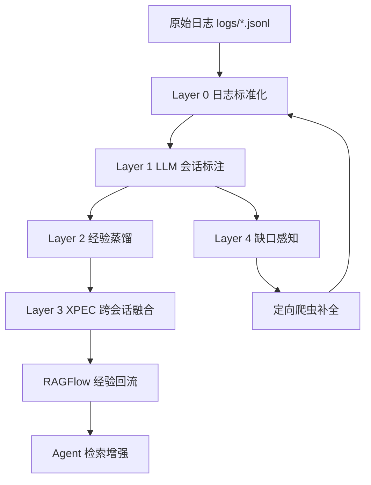

# LORE · 渗透测试知识蒸馏系统

<div align="center">

### Reflective Offensive Knowledge Distillation Engine

从真实渗透测试会话中，自动提炼可复用攻防经验，持续构建可检索、可回流、可演进的安全知识库。

[](https://www.python.org/)
[](https://flask.palletsprojects.com/)
[](https://github.com/infiniflow/ragflow)
[](#系统架构)
[](./LICENSE)

</div>

---

## 目录

- [项目定位](#项目定位)
- [核心能力](#核心能力)
- [系统架构](#系统架构)
- [知识层模型](#知识层模型)
- [快速开始](#快速开始)
- [运行方式](#运行方式)
- [RAGFlow 路由说明（重点）](#ragflow-路由说明重点)
- [数据采集与补全](#数据采集与补全)
- [Dashboard 概览](#dashboard-概览)
- [项目结构](#项目结构)
- [文档索引](#文档索引)
- [常见问题](#常见问题)
- [开发与测试](#开发与测试)
- [安全与合规声明](#安全与合规声明)
- [许可证](#许可证)

---

## 项目定位

LORE（Reflective Penetration Testing）是一个面向渗透测试场景的多层知识蒸馏系统。
它将原始攻防日志转化为五类结构化经验，并通过跨会话融合与缺口感知机制，让知识库持续迭代。

一句话概括：

- 输入：真实渗透会话日志与多源安全语料
- 处理：Layer 0~4 流水线蒸馏 + XPEC 融合 + 缺口定向爬取
- 输出：可检索、可解释、可回流 RAGFlow 的安全经验知识库

---

## 核心能力

| 能力 | 说明 | 价值 |
|---|---|---|
| 五层蒸馏流水线 | Layer 0~4 分层处理日志、经验、融合、缺口 | 全链路自动化 |
| 五类知识产物 | FACTUAL / PROCEDURAL_POS / PROCEDURAL_NEG / METACOGNITIVE / CONCEPTUAL | 结构化沉淀 |
| XPEC 跨会话融合 | SEC/EWC/RME/BCC/KLM 多阶段融合注册 | 降噪、去重、提纯 |
| 缺口感知补全 | 从失败根因反推知识盲区并触发爬取 | 闭环成长 |
| RAGFlow 回流 | 融合后的高价值经验自动上传向量库 | 直接服务检索 |
| Dashboard 可视化 | 经验浏览、会话分析、任务管理、缺口补全 | 运维与运营一体化 |

---

## 系统架构



流水线入口：

- 主流程：run/run_full_pipeline.py
- 交互式入口：lore.py
- Dashboard：dashboard/app.py

---

## 知识层模型

| 层级 | 枚举值 | 内容举例 |
|---|---|---|
| 事实层 | FACTUAL | CVE、受影响版本、利用前置条件 |
| 正向步骤层 | PROCEDURAL_POS | 成功命令序列、验证信号、适用约束 |
| 负向步骤层 | PROCEDURAL_NEG | 失败命令、报错、根因、避坑策略 |
| 元认知层 | METACOGNITIVE | 决策规则、策略迁移、经验法则 |
| 概念层 | CONCEPTUAL | 攻击原理、工具机制、抽象模式 |

---

## 快速开始

### 1) 环境准备

```bash
git clone <your-repo-url>
cd Evo-PentestRAG-main
python -m venv .venv
.venv\Scripts\activate
pip install -r requirements.txt
```

### 2) 配置关键参数

- 用户必填配置：configs/config.yaml
  - LLM API：llm 节
  - RAGFlow API 与知识库 ID：ragflow 节
- 设计配置（维护者管理）：configs/design.yaml
  - tool_categories / parser / layer4 调度等设计级参数

### 3) 启动 Dashboard

```bash
cd dashboard
python app.py
```

访问：http://localhost:5000

### 4) 运行全流程

```bash
cd ..
python run/run_full_pipeline.py
```

---

## 运行方式

### A. 交互式（推荐）

```bash
python lore.py
```

支持：

- 全量流水线运行
- 自选阶段运行
- 状态查看
- 手动上传

### B. 命令行分阶段运行

```bash
python run/run_layer0.py --log-dir logs --output-dir data/layer0_output
python run/run_layer1_llm_batch.py
python run/run_layer2_analysis.py --no-ragflow
python run/run_layer3_phase12.py
python run/run_layer3_phase34.py
python run/run_layer3_phase5.py
python run/run_layer4_gap_dispatch.py --no-crawl
python -m src.ragflow.uploader --source fused
```

### C. 流水线状态查看

```bash
python run/run_full_pipeline.py --status
```

---

## RAGFlow 路由说明（重点）

为避免看不到 CONCEPTUAL 上传的混淆，当前路由约定如下。

| 知识层 | 路由键 | 默认用途 |
|---|---|---|
| FACTUAL | dataset_factual | 事实知识检索库 |
| PROCEDURAL_POS | dataset_procedural_pos | 成功步骤检索库 |
| PROCEDURAL_NEG | dataset_procedural_neg | 失败经验/避坑库 |
| METACOGNITIVE | dataset_metacognitive | meta_conceptual 组合库 |
| CONCEPTUAL | dataset_metacognitive | meta_conceptual 组合库 |
| 预留全量库 | full_dataset | 仅用于全量归档预留，默认路由不启用 |

说明：

- METACOGNITIVE 与 CONCEPTUAL 统一进入 dataset_metacognitive（即 meta_conceptual）。
- full_dataset 仅保留为未来全量归档或离线实验用途，不参与默认分层上传。

### 仅 CONCEPTUAL 定向补传示例

```bash
python -m src.ragflow.uploader --source fused --exp-ids exp_consolidated_xxx,exp_consolidated_yyy,exp_consolidated_zzz --retry-502-max 8 --retry-base-sec 2.0
```

---

## 数据采集与补全

### 多源实时爬虫

```bash
python crawlers/main_crawler.py --all -q "CVE-2024-xxxx" --yes
python crawlers/main_crawler.py --sources csdn,github -q "WebLogic 反序列化" --max-pages 8
```

### 外部知识库同步

```bash
python crawlers/sync_data_light.py
python crawlers/sync_data_light.py --repos cisa-kev,cwe,nvd
```

### Layer 4 缺口感知调度

```bash
python run/run_layer4_gap_dispatch.py
```

---

## Dashboard 概览

Dashboard 提供以下核心页面：

- 总览看板：经验体量、层级分布、会话质量
- 五类经验页：FACTUAL / POS / NEG / META / CONCEPTUAL
- 会话浏览：逐轮事件与根因复盘
- 融合经验库：冲突、成熟度、知识健康状态
- 经验缺口分析：Gap Score + 一键定向爬取
- 爬虫管理：多源抓取与同步任务

启动命令：

```bash
cd dashboard
python app.py
```

---

## 项目结构

```text
.
 configs/
 crawlers/
 dashboard/
 data/
   layer0_output/
   layer1_output/
   layer2_output/
   layer3_output/
   layer4_output/
 docs/
 raw_data/
 run/
   run_full_pipeline.py
   run_layer0.py
   run_layer1_llm_batch.py
   run_layer2_analysis.py
   run_layer3_phase12.py
   run_layer3_phase34.py
   run_layer3_phase5.py
   run_layer4_gap_dispatch.py
 src/
   layer0/
   layer1/
   layer2/
   layer3/
   layer4/
   ragflow/
     uploader.py
   ragflow_uploader.py
 lore.py
```

---

## 文档索引

- docs/01_OVERVIEW.md：项目概览
- docs/02_ARCHITECTURE.md：详细架构与模块说明
- docs/03_USAGE_GUIDE.md：部署、运行、排错指南
- docs/04_Log Adapter  多框架日志接入指南.md：多框架日志适配
- CHANGELOG.md：版本变更记录
- CONTRIBUTING.md：贡献指南

---

## 常见问题

### Q1：为什么在 meta_conceptual 看不到 CONCEPTUAL？

请检查路由映射是否为：CONCEPTUAL -> dataset_metacognitive。
当前默认即此配置，full_dataset 不参与默认上传。

### Q2：RAGFlow 上传偶发 502 怎么办？

使用重试参数：

```bash
python -m src.ragflow.uploader --source fused --retry-502-max 8 --retry-base-sec 2.0
```

### Q3：只补传某几条经验怎么做？

```bash
python -m src.ragflow.uploader --source fused --exp-ids exp_a,exp_b,exp_c
```

---

## 开发与测试

```bash
pytest -q
```

建议流程：

1. 先跑单阶段脚本验证数据输出
2. 再跑 run/run_full_pipeline.py 串联验证
3. 最后执行上传与 Dashboard 联调

---

## 安全与合规声明

本项目用于合法授权范围内的安全研究、攻防演练与教学。
请勿将其用于未授权系统的攻击行为。

---

## 许可证

本项目采用 MIT License，详见 LICENSE。

---

<div align="center">

如果这个项目对你有帮助，欢迎点亮 Star，并在 Issue 中反馈你的场景与需求。

</div>
