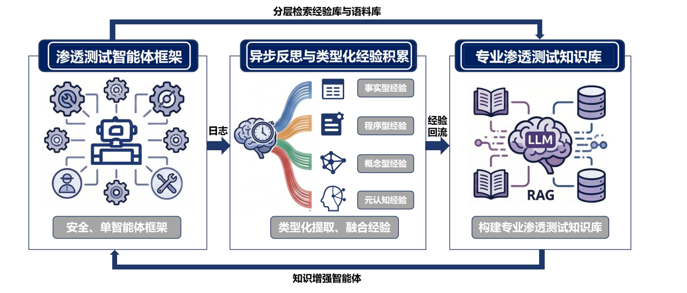
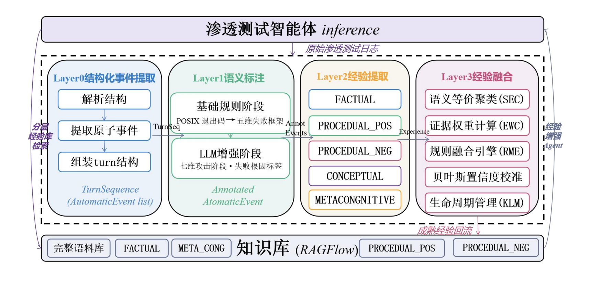
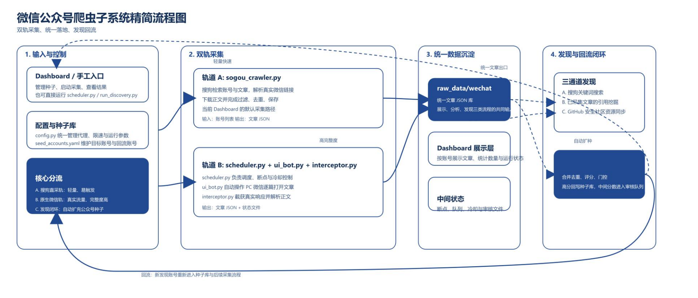

# README: 语言切换

[English](README_en.md) | [中文](README.md)

# LORE · 渗透测试知识蒸馏系统

<div align="center">

### Reflective Offensive Knowledge Distillation Engine
从真实渗透测试会话中，自动提炼可复用攻防经验，持续构建可检索、可回流、可演进的安全知识库。

[](https://www.python.org/)
[](https://flask.palletsprojects.com/)
[](https://github.com/infiniflow/ragflow)
[](#系统架构)
[](./LICENSE)

</div>

---

## 目录

- [项目定位](#项目定位)
- [核心能力](#核心能力)
- [系统架构](#系统架构)
- [知识层模型](#知识层模型)
- [快速开始](#快速开始)
- [运行方式](#运行方式)
- [RAGFlow 路由说明（重点）](#ragflow-路由说明重点)
- [数据采集与补全](#数据采集与补全)
- [项目现状](#项目现状)
- [Dashboard 概览](#dashboard-概览)
- [项目结构](#项目结构)
- [文档索引](#文档索引)
- [常见问题](#常见问题)
- [开发与测试](#开发与测试)
- [安全与合规声明](#安全与合规声明)
- [许可证](#许可证)

---

## 项目定位

LORE（Reflective Penetration Testing）是一个面向渗透测试场景的多层知识蒸馏系统。
它将原始攻防日志转化为五类结构化经验，并通过跨会话融合与缺口感知机制，让知识库持续迭代。

一句话概括：

- 输入：真实渗透会话日志与多源安全语料
- 处理：Layer 0~4 流水线蒸馏 + XPEC 融合 + 缺口定向爬取
- 输出：可检索、可解释、可回流 RAGFlow 的安全经验知识库



---

## 核心能力

| 能力 | 说明 | 价值 |
|---|---|---|
| 五层蒸馏流水线 | Layer 0~4 分层处理日志、经验、融合、缺口 | 全链路自动化 |
| 五类知识产物 | FACTUAL / PROCEDURAL_POS / PROCEDURAL_NEG / METACOGNITIVE / CONCEPTUAL | 结构化沉淀 |
| XPEC 跨会话融合 | SEC/EWC/RME/BCC/KLM 多阶段融合注册 | 降噪、去重、提纯 |
| 缺口感知补全 | 从失败根因反推知识盲区并触发爬取 | 闭环成长 |
| RAGFlow 回流 | 融合后的高价值经验自动上传向量库 | 直接服务检索 |
| Dashboard 可视化 | 经验浏览、会话分析、任务管理、缺口补全 | 运维与运营一体化 |

---

## 系统架构

流水线入口：

- 主流程：run/run_full_pipeline.py
- 交互式入口：lore.py
- Dashboard：dashboard/app.py



---

## 知识层模型

| 层级 | 枚举值 | 通用举例 |
|---|---|---|
| 事实层 | FACTUAL | CVE、受影响版本、利用前置条件 |
| 正向步骤层 | PROCEDURAL_POS | 成功命令序列、验证信号、适用约束 |
| 负向步骤层 | PROCEDURAL_NEG | 失败命令、报错、根因、避坑策略 |
| 元认知层 | METACOGNITIVE | 决策规则、策略迁移、经验法则 |
| 概念层 | CONCEPTUAL | 攻击原理、工具机制、抽象模式 |

---

## 快速开始

### 1) 环境准备

```bash
git clone <your-repo-url>
cd Evo-PentestRAG-main
python -m venv .venv
.venv\Scripts\activate
pip install -r requirements.txt
```

### 2) 配置关键参数

- 用户必填配置：configs/config.yaml
  - LLM API：llm 节
  - RAGFlow API 与知识库 ID：ragflow 节
- 设计配置（维护者管理）：configs/design.yaml
  - tool_categories / parser / layer4 调度等设计级参数

### 3) 启动 Dashboard

```bash
cd dashboard
python app.py
```

访问：http://localhost:5000

### 4) 运行全流程

```bash
cd ..
python run/run_full_pipeline.py
```

---

## 运行方式

### A. 交互式（推荐）

```bash
python lore.py
```

支持：

- 全量流水线运行
- 自选阶段运行
- 状态查看
- 手动上传

### B. 命令行分阶段运行

```bash
python run/run_layer0.py --log-dir logs --output-dir data/layer0_output
python run/run_layer1_llm_batch.py
python run/run_layer2_analysis.py --no-ragflow
python run/run_layer3_phase12.py
python run/run_layer3_phase34.py
python run/run_layer3_phase5.py
python run/run_layer4_gap_dispatch.py --no-crawl
python -m src.ragflow.uploader --source fused
```

### C. 流水线状态查看

```bash
python run/run_full_pipeline.py --status
```

---

## RAGFlow 路由说明（重点）

为避免看不到 CONCEPTUAL 上传的混淆，当前路由约定如下。

| 知识层 | 路由键 | 默认用途 |
|---|---|---|
| FACTUAL | dataset_factual | 事实知识检索库 |
| PROCEDURAL_POS | dataset_procedural_pos | 成功步骤检索库 |
| PROCEDURAL_NEG | dataset_procedural_neg | 失败经验/避坑库 |
| METACOGNITIVE | dataset_metacognitive | meta_conceptual 组合库 |
| CONCEPTUAL | dataset_metacognitive | meta_conceptual 组合库 |
| 预留全量库 | full_dataset | 仅用于全量归档预留，默认路由不启用 |

说明：

- METACOGNITIVE 与 CONCEPTUAL 统一进入 dataset_metacognitive（即 meta_conceptual）。
- full_dataset 仅保留为未来全量归档或离线实验用途，不参与默认分层上传。

### 仅 CONCEPTUAL 定向补传示例

```bash
python -m src.ragflow.uploader --source fused --exp-ids exp_consolidated_xxx,exp_consolidated_yyy,exp_consolidated_zzz --retry-502-max 8 --retry-base-sec 2.0
```

---

## 数据采集与补全

系统提供双轨数据采集能力，支持从实时爬虫和外部知识库两个维度持续扩充安全语料。

### 多源实时爬虫

覆盖 5 个安全数据源（CSDN / GitHub / 奇安信 / 先知 / 微信公众号），支持按关键词或 CVE 定向爬取：

```bash
python crawlers/main_crawler.py --all -q "CVE-2024-xxxx" --yes
python crawlers/main_crawler.py --sources csdn,github -q "WebLogic 反序列化" --max-pages 8
```

### 微信公众号采集

支持种子账号管理、搜狗直采与原生微信双模式切换、mitmdump 代理联调、文章预览与状态自检。



### 外部知识库同步

一键同步 11 个外部安全数据库：

```bash
python crawlers/sync_data_light.py
python crawlers/sync_data_light.py --repos cisa-kev,cwe,nvd
```

| 数据库 | 说明 |
|---|---|
| MITRE ATT&CK | 攻击技术及子技术最新知识库 |
| CISA KEV | 已知被利用漏洞目录 |
| CWE / CAPEC | 弱点枚举 / 攻击模式枚举 |
| D3FEND | 防御对策知识库 |
| GitHub Advisory | GitHub 安全公告 |
| ZDI | Zero Day Initiative 漏洞通告 |
| CVE / NVD | 通用漏洞与暴露 / 国家漏洞数据库 |
| Exploit-DB | 漏洞利用代码库 |
| Linux Vulns | Linux 内核及发行版漏洞追踪 |

### Layer 4 缺口感知调度

从 Layer 1 失败标注反向推导知识盲区，按 P0（立即）/ P1（每日）/ P2（每周）三级优先级触发定向爬取：

```bash
python run/run_layer4_gap_dispatch.py
```

---

## 项目现状

### 已实现

- Layer 0 日志标准化（4 种框架适配器，自动识别日志格式）
- Layer 1 LLM 批量标注（15 份日志，415 事件，171 次失败，5 维度失败分类）
- Layer 2 经验蒸馏（规则引擎 + LLM，172 条经验产物，5 类知识全覆盖）
- Layer 3 XPEC 跨会话融合（SEC/EWC/RME/BCC/KLM 5 阶段，137 条 KLM，55 条冲突标记）
- Layer 4 缺口感知爬取框架（7 类缺口维度，P0/P1/P2 三级调度）
- RAGFlow 回流（6 条高置信 KLM 已同步至向量库）
- 多源爬虫框架（5 个数据源 + 11 个外部数据库）
- Web Dashboard（全流水线触发、知识健康状态、经验缺口分析、爬虫管理）
- pytest 测试套件（276 个用例）

### 进行中

- RAGFlow 批量同步（目标：全部 KLM 同步至 RAGFlow）
- Layer 4 自动调度稳定性优化

---

## Dashboard 概览

系统采用"顶部状态栏 + 左侧功能导航 + 主工作区"的工作台式布局，按"经验库、分析、融合、知识库"分区组织，覆盖采集、提炼、治理、回流的完整业务链路。

### 总览看板与统计分析

展示经验总量、五类知识计数、会话数等核心指标，通过知识层分布、会话结果分布、置信度分布、目标服务分布、攻击阶段分布等图表呈现知识资产质量。


### 五类经验库浏览与检索

FACTUAL、PROCEDURAL_POS、PROCEDURAL_NEG、METACOGNITIVE、CONCEPTUAL 五类独立分页展示，每类页面支持关键词检索、分页浏览。经验卡片展示 exp_id、置信度、目标服务、CVE 标签、提取来源和摘要信息。


### 经验详情弹窗

点击经验卡片弹出详情窗口，展示元数据（来源会话、结果、置信度、提取方式、目标服务、CVE、创建时间），并按知识层展示专属内容：FACTUAL 提供"发现事实 + 原始证据"；PROCEDURAL_NEG 提供"失败命令、失败模式、决策规则、修复建议"；PROCEDURAL_POS 提供"参数化命令模板、成功证据、前置条件、后续动作"；METACOGNITIVE 与 CONCEPTUAL 展示经验教训、核心洞察与触发条件。


### 会话浏览与复盘分析

以 Session 为中心组织数据，展示目标服务、CVE、攻击结果、经验总量与分层分布，提供"过程视角"便于回看单次攻防的知识产出质量和失败集中区域。


### 分阶段流水线运行与实时日志

提供 Layer0 至 Upload 的分阶段执行能力，支持全选/全不选、跳过上传、详细日志、状态重置，并通过 SSE 实时展示各阶段状态、耗时与当前执行步骤。顶部提供"开启反思"快捷触发按钮，一键发起核心蒸馏流程。


### 爬虫管理

覆盖"采集、同步、清理"全生命周期：
- **微信公众号**：种子账号管理、全选/新增/移除、搜狗直采与原生微信双模式切换、mitmdump 联调、文章预览
- **网站爬虫**：多数据源（CSDN / GitHub / 奇安信 / 先知）按关键词/CVE 定向爬取
- **RSS 自动订阅**：状态展示与手动立即同步
- **外部知识库同步**：11 个数据库（ATT&CK / CISA KEV / CWE / CAPEC / D3FEND / GitHub Advisory / ZDI / CVE / NVD / Exploit-DB / Linux Vulns）按需选择性同步
- **RAG 源文件管理**：按来源、按文件、按全量级别清理数据


### Layer3 融合经验库、知识健康与缺口补全

页面顶部可视化呈现"原始经验 → 等价集聚类 → 规则融合 → 置信度校准 → 权威知识"流程，展示压缩比、成熟度、平均融合置信度等指标。底部"知识健康状态"展示生命周期分布与冲突条目；"经验缺口分析"基于 gap score 给出待补全方向，可直接填入关键词触发定向爬取，形成闭环优化链路。


### RAGFlow 对接与知识回流

展示系统与外部 RAGFlow 检索平台的集成状态，提供一键跳转入口与集成说明。融合后的高价值经验可回流至向量数据库，为下游智能问答和 Agent 决策提供可调用知识底座。


启动命令：

```bash
cd dashboard
python app.py
```

访问：http://localhost:5000

---

## 项目结构

```text
.
 configs/
 crawlers/
 dashboard/
 data/
   layer0_output/
   layer1_output/
   layer2_output/
   layer3_output/
   layer4_output/
 docs/
 raw_data/
 run/
   run_full_pipeline.py
   run_layer0.py
   run_layer1_llm_batch.py
   run_layer2_analysis.py
   run_layer3_phase12.py
   run_layer3_phase34.py
   run_layer3_phase5.py
   run_layer4_gap_dispatch.py
 src/
   layer0/
   layer1/
   layer2/
   layer3/
   layer4/
   ragflow/
     uploader.py
   ragflow_uploader.py
 lore.py
```

---

## 文档索引

- docs/01_OVERVIEW.md：项目概览
- docs/02_ARCHITECTURE.md：详细架构与模块说明
- docs/03_USAGE_GUIDE.md：部署、运行、排错指南
- docs/04_Log Adapter  多框架日志接入指南.md：多框架日志适配
- CHANGELOG.md：版本变更记录
- CONTRIBUTING.md：贡献指南

---

## 常见问题

### Q1：为什么在 meta_conceptual 看不到 CONCEPTUAL？

请检查路由映射是否为：CONCEPTUAL -> dataset_metacognitive。
当前默认即此配置，full_dataset 不参与默认上传。

### Q2：RAGFlow 上传偶发 502 怎么办？

使用重试参数：

```bash
python -m src.ragflow.uploader --source fused --retry-502-max 8 --retry-base-sec 2.0
```

### Q3：只补传某几条经验怎么做？

```bash
python -m src.ragflow.uploader --source fused --exp-ids exp_a,exp_b,exp_c
```

---

## 开发与测试

```bash
pytest -q
```

建议流程：

1. 先跑单阶段脚本验证数据输出
2. 再跑 run/run_full_pipeline.py 串联验证
3. 最后执行上传与 Dashboard 联调

---

## 安全与合规声明

本项目用于合法授权范围内的安全研究、攻防演练与教学。
请勿将其用于未授权系统的攻击行为。

---

## 许可证

本项目采用 MIT License，详见 LICENSE。

---

<div align="center">

如果这个项目对你有帮助，欢迎点亮 Star，并在 Issue 中反馈你的场景与需求。

</div>
