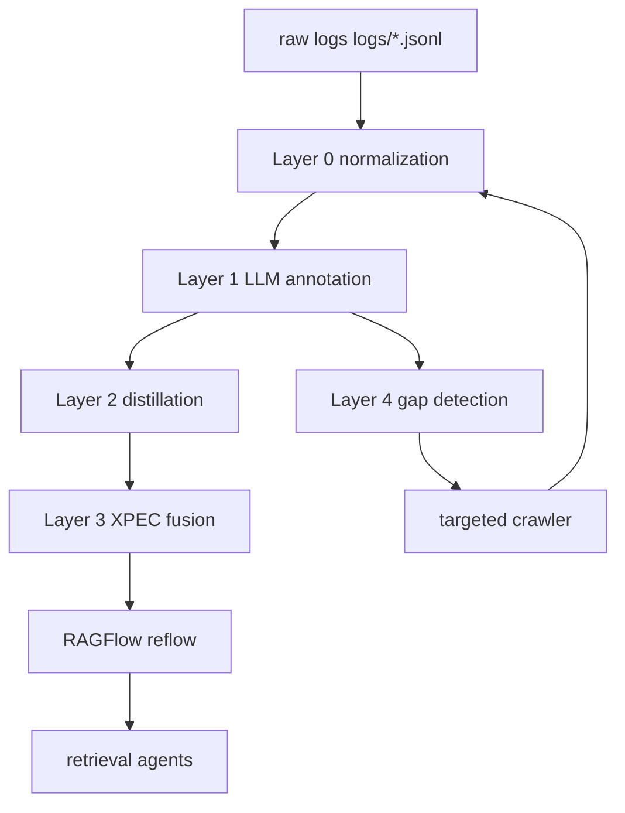

git clone <your-repo-url>
# LORE · Reflective Offensive Knowledge Distillation Engine

[English](README_en.md) | [中文](README.md)

<div align="center">

### Reflective Offensive Knowledge Distillation Engine
LORE extracts reusable offensive and defensive knowledge from real penetration testing sessions and builds an evolving, searchable, and reflow-capable security knowledge base.

Badges

- Python 3.10+
- Flask dashboard
- RAGFlow integration

---

## Table of Contents

- Project Overview

- Core Capabilities
- System Architecture
- Knowledge Layer Model
- Quick Start
- Run Modes
- RAGFlow Routing (Important)
- Data Collection & Augmentation
- Dashboard Overview
- Project Structure
- Documentation Index
- FAQ
- Development & Testing
- Security & Compliance
- License

---

## Project Overview

LORE (Reflective Penetration Testing) is a layered knowledge distillation system for penetration testing scenarios. It transforms raw offensive/defensive logs into five categories of structured experience and uses cross-session fusion and gap-aware crawling to let the knowledge base evolve continuously.

One-line summary:

- Input: real penetration session logs + multi-source security corpora
- Process: Layer 0~4 pipeline distillation + XPEC fusion + gap-driven crawling
- Output: retrievable, explainable artifacts served via RAGFlow

---

## Core Capabilities

| Capability | Description |
|---|---|
| Layered pipeline (Layer 0~4) | Structured processing from raw logs to fused knowledge |
| Five artifact types | FACTUAL / PROCEDURAL_POS / PROCEDURAL_NEG / METACOGNITIVE / CONCEPTUAL |
| XPEC cross-session fusion | Multi-stage fusion to reduce noise and consolidate evidence |
| Gap-aware augmentation | Detects missing knowledge and triggers targeted crawling |
| RAGFlow reflow | Upload high-value artifacts to RAGFlow for retrieval |
| Dashboard | Visualize artifacts, sessions, and gap analysis |

---

## System Architecture



Entry points:

- Main pipeline: `run/run_full_pipeline.py`
- Interactive: `lore.py`
- Dashboard: `dashboard/app.py`

---

## Knowledge Layer Model

| Layer | Enum | Example |
|---|---|---|
| FACTUAL | FACTUAL | CVE details, affected versions |
| PROCEDURAL_POS | PROCEDURAL_POS | Successful command sequences, verification signals |
| PROCEDURAL_NEG | PROCEDURAL_NEG | Failed commands, error reasons, mitigation notes |
| METACOGNITIVE | METACOGNITIVE | Decision rules, strategy heuristics |
| CONCEPTUAL | CONCEPTUAL | Attack principles, tool mechanisms |

---

## Quick Start

1) Environment

```bash
git clone <your-repo-url>
cd LORE
python -m venv .venv
.venv\Scripts\activate
pip install -r requirements.txt
```

2) Config

- Required: `configs/config.yaml` (LLM and RAGFlow credentials, dataset IDs)
- Design-level settings: `configs/design.yaml`

3) Start Dashboard

```bash
cd dashboard
python app.py
```

Visit: http://localhost:5000

4) Run full pipeline

```bash
cd ..
python run/run_full_pipeline.py
```

---

## Run Modes

Interactive (recommended):

```bash
python lore.py
```

Command-line stages:

```bash
python run/run_layer0.py --log-dir logs --output-dir data/layer0_output
python run/run_layer1_llm_batch.py
python run/run_layer2_analysis.py --no-ragflow
python run/run_layer3_phase12.py
python run/run_layer3_phase34.py
python run/run_layer3_phase5.py
python run/run_layer4_gap_dispatch.py --no-crawl
python -m src.ragflow.uploader --source fused
```

Pipeline status:

```bash
python run/run_full_pipeline.py --status
```

---

## RAGFlow Routing (Important)

Default routing conventions:

| Knowledge Layer | Route Key |
|---|---|
| FACTUAL | dataset_factual |
| PROCEDURAL_POS | dataset_procedural_pos |
| PROCEDURAL_NEG | dataset_procedural_neg |
| METACOGNITIVE | dataset_metacognitive |
| CONCEPTUAL | dataset_metacognitive |
| Full archive | full_dataset |

Notes:

- METACOGNITIVE and CONCEPTUAL are combined into `dataset_metacognitive` by default.
- `full_dataset` is reserved for full archives and not used in normal uploads.

Example: upload only specific consolidated conceptual artifacts

```bash
python -m src.ragflow.uploader --source fused --exp-ids exp_consolidated_xxx,exp_consolidated_yyy --retry-502-max 8 --retry-base-sec 2.0
```

---

## Data Collection & Augmentation

Multi-source crawlers examples:

```bash
# Generic vulnerability intelligence
python crawlers/main_crawler.py --all -q "CVE-2024-xxxx" --yes
```

External sync:

```bash
python crawlers/sync_data_light.py --repos cisa-kev,cwe,nvd
```

Layer 4 gap dispatcher:

```bash
python run/run_layer4_gap_dispatch.py
```

---

## Dashboard Overview

Core pages:

- Overview: artifact counts and layer distribution
- Five artifact pages: FACTUAL / POS / NEG / META / CONCEPTUAL
- Session browser and event replay
- Fused artifact management and health
- Gap analysis and one-click crawling
- Crawler management

Start:

```bash
cd dashboard
python app.py
```

---

## Project Structure

```
.
 configs/
 crawlers/
 dashboard/
 data/
 docs/
 run/
 src/
 lore.py
```

---

## Documentation Index

- `docs/01_OVERVIEW.md`: project overview
- `docs/02_ARCHITECTURE.md`: architecture
- `docs/03_USAGE_GUIDE.md`: deployment and troubleshooting

---

## FAQ

Q: Why don't I see CONCEPTUAL artifacts in meta_conceptual?

A: Check routing: CONCEPTUAL -> dataset_metacognitive. By default CONCEPTUAL is routed into the metacognitive dataset.

Q: What to do about intermittent 502s when uploading to RAGFlow?

A: Use retry flags:

```bash
python -m src.ragflow.uploader --source fused --retry-502-max 8 --retry-base-sec 2.0
```

---

## Development & Testing

Run tests:

```bash
pytest -q
```

Recommended flow:

1. Validate single-stage outputs
2. Run `run/run_full_pipeline.py` for integration
3. Upload and verify with Dashboard

---

## Security & Compliance

This project is intended for authorized security research, testing, and education only. Do not use it against systems without explicit permission.

---

## License

MIT License. See LICENSE file.
